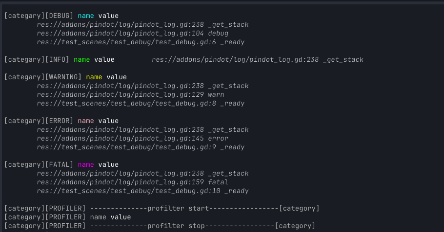

# 调试工具

## 日志
打印日志
```gdscript
func _ready() -> void:
	# 可以打印调试信息
	Pindot.log.debug("name", "value", "categary")
	Pindot.log.info("name", "value", "categary")
	Pindot.log.warn("name", "value", "categary")
	Pindot.log.error("name", "value", "categary")
	Pindot.log.fatal("name", "value", "categary")

	# 可以记录分析日志
	Pindot.log.profiler_start("category")
	Pindot.log.profiler("name", "value", "categary")
	Pindot.log.profiler_stop("category")
```

在godot编辑器中的效果



在vscode中的效果


要打印纯净的日志(不包含多余的颜色等信息), 需要在vscode的`lauch.json`中配置
```json
{
    "configurations": [
        {
            "name": "Launch",
            "type": "godot",
            "request": "launch",
            "project": "${workspaceFolder}",
            "address": "127.0.0.1",
            "port": 6007,
            // 这里用 pindot_log_pure 区分打印是否包含颜色
            "additional_options": "pindot_log_pure",
        }
    ]
}
```
